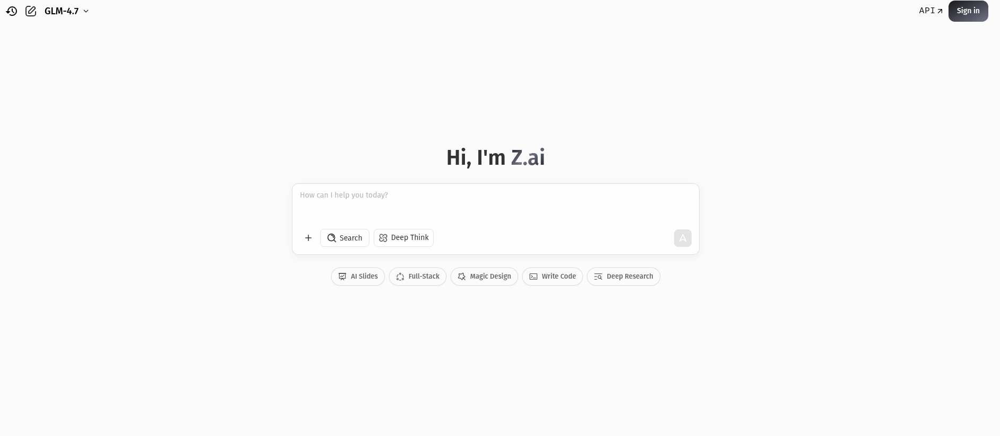

# Product requirements specification

## Libs

- clsx
- markdown-it
- highlight.js (*atom-one-light theme*)
- @mdit/plugin-katex
- react-router
- jotai
- shadcn
- react-bits
- better-auth

## Backend services

- Cloduflare R2
- Postgres

## Models to use

### Utility models

- Grok 4.1 fast
- gpt-oss-120b
- GLM 4.7

### Modification models

- Grok 4.1 fast
- gpt-oss-120b
- GLM 4.7

### First-shot generation models

- Gemini 3 Pro
- Gemini 3 Flash
- GLM 4.7
- Kimi K2

### OCR models

- Mistral OCR
- Deepseek OCR
- Gemini 3 Flash

### Voice transcription models

- voxtral-mini-2507

## Routes

- `/`: landing
- `/login`: login page
- `/signup`: sign up page
- `/explore`: explore decks from public sources (mostly github files and gists)
- `/generate`: chat session to generate, modify and save a deck
- `/decks`: explore you decks. Also shows stats and has an button so the user can upload its own deck.
- `/decks/$deckId`: visualize the content of a deck including stats from previous study sessions for the selected deck
- `/decks/edit/$deckId`: edit the content of a deck
- `/study/$deckId`: start a study session with a deck
- `/my`: display and manage user information, integration, etc. This is the section where the user is able to change password, auth methods, username, default settings for model selection, language
- `/my/security`
- `/my/preferences`
- `/my/destroy`
- `/docs`: Documentation section

## Fonts & icons

- DM Sans
- IBM Plex Mono
- [Lucide icons](https://lucide.dev/guide/packages/lucide-react)

## Main UI components

### Live markdown editor (with LateX support and code highlighting)

This would be a react component with a text area where the user will be able to enter/modify markdown content and a preview element alongside (or maybe with toggable visibility for devices with narrower screen size).

### Chat component

Will be composed of a text box where the user fill be able to chat with the agent. Initially deck generation sessions will begin with the user providing some knowledge source (PDF, web page, MD or txt file or maybe an image) and some instructions. Once the agent generates the first draft for the deck refinements will be made upon it. The two mechanisms for modidying the deck during the session will be: direct modification by the user and agentic modification (the user requests the agent to modify the deck).

**Also, users must be able to use MCPs servers that may connect the agent to knowledge sources.**

### Markdown preview component

This component will be used in the the live markdown editor component and in other routes to preview markdown content from flashcards. Generally, it will be used any time markdown content must be rendered and shown to the user.

### Flashcard question/answer display

To display the back from a flashcard and let the user to recall/enter the answer, then collect if the answer was right or wrong, then show next card til exhausting all cards in deck.

### Feature to let the user to the answer and make the LLM to assess if right or wrong

This'll be a future feature.

## Core backend logic

### Deck generation agent

The main mechanism to create the flashcards will be an agent and the interface will be a chat.

### Storage and retrieval logic

Each user will have 500MB of storage space in Cloudflare R2 for decks.

### Document preprocessing

Each PDF and image must be converted to MD/LaTeX before passing content to the LLMs. Mainly, Mistral OCR and Deepseek OCR will be used for this.

A web scraper agentic workflow will be created to extract knowledge from the web more effciently.

## Other features

### Autosave feature

As a user modifies a deck changes must be cached and sent to the server. In case the user quit inexpectedly from the app the drafted changes must be saved and presented to the user in case they may want to recover.

### Versioning feature

Not to be implemented yet. Will be reconsidered in future releases.